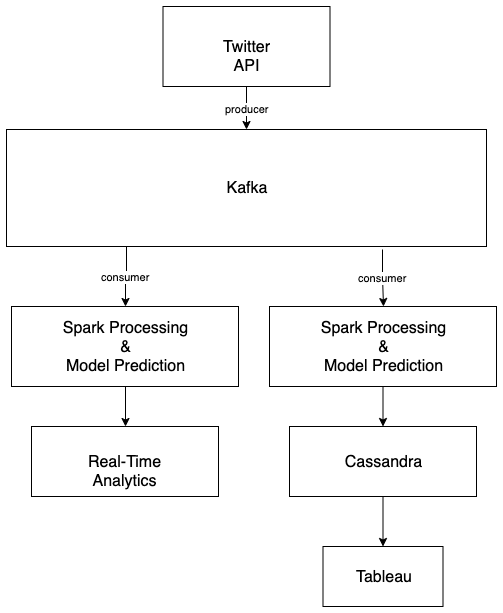

# Twitter-Inappropriate-Language-Detection

### Project Description

Our project aims to perform inappropriate language detection in tweets. In order to do that, the tweets will be fetched from the **Twitter Streaming API** and temporarily stored in **Apache Kafka**. After storing the tweets in Kafka, there will be two consumers. Each consumer, using **Spark streaming**, will read the tweets from Kafka, preprocess and classify the tweets as inappropriate or not.

The two consumers will do the following:

1. One consumer will save the preprocessed tweets to **Apache Cassandra NoSQL database** and create some analytics. Then, from the database, the data will be read, and Tableau will be used for visualization. The statistics include grouping of inappropriate tweets per country and per user.
2. The other consumer will present analytics in real time and print the results. This analysis will show the real-time statistics grouped by user (i.e. how many offensive tweets each user has).

To prevent failure checkpoints are added in the two consumers and if a consumer fail it restarts from the latest checkpoint. Moreover, the model predictions of inappropriate tweets will be based on the pretrained model of this repo [Toxic-Language-Detection-in-Online-Content](https://github.com/adityagaydhani/Toxic-Language-Detection-in-Online-Content)

The architecture is shown below 



### Dependencies

 - Docker
 - Tableau (optional)

### RUNNING 

1. start docker

Then open a terminal
```
$ cd /path/to/root/folder
$ docker-compose up -d --build
``` 

### Additional

**Portainer** is added inside the docker-compose.yml file which is a web interface of the docker that allows easy management of the containers etc. To see an web interface of the container with logs, results etc. open a browser and type the url http://DOCKER_HOST:9000. A web ui (portainer) will be shown. If it is run locally then http://localhost:9000. Create account and login to see containers.